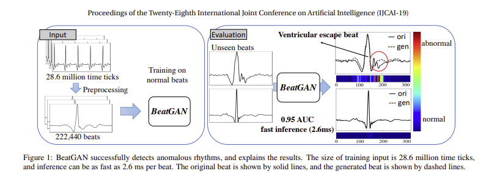
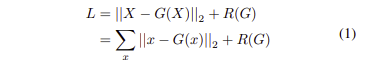
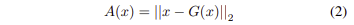
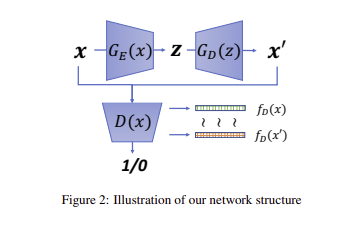
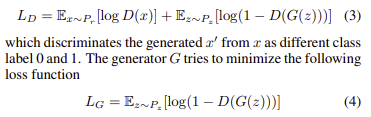
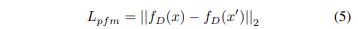
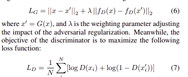
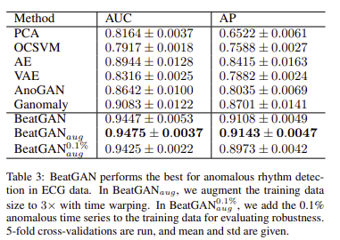
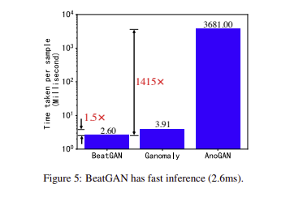

## BeatGAN 
Paper Link: [Link](https://www.ijcai.org/Proceedings/2019/0616.pdf)

### Abstract 
- Time Series Data들에 대해서 Anomaly Detection을 수행하는데 있어서, GAN구조를 이용한 BeatGAN을 이용함
- 해당 방식은 Unsupervsied anomaly detection algorithm을 사용함
- BeatGAN을 통해서 input beats에 대해서 anomalous time ticks에 대해서 explainable results를 출력할 수 있음
- 기존의 AE,CAE와 마찬가지로 Reconstruction Error를 사용하며, Times series warpping을 이용하여 Data-Augmentation을 수행 
- 0.95AUC, 2.6ms per beat의 fast Inference 성능을 보여줌
- 이외에 Multivariate motion-capture로 부터 unusual motion을 탐지


### Introduction
- Anomaly Detection from normal times series 
    - GAN기반의 Reconstruction error를 이용하는 BeatGAN 제안
- Effectiveness & Explainability & Generality 


### Proposed Model
- $\Tau \in \mathbb{R}^{M \times N}$ : Multi-variate time series  
    - N : time ticks in length
    - M : each time tick의 dimensions

- 논문에서는 Input Beats $x$ : $\in \mathbb{R}^{L \times N}$의 window size로 고정
    - L  :beat를 포함하는 적당히 큰 수 

<p>
    
</p>


### Optimization objective for learning reconstruction model
<p>
    
</p>

- $X$ : columns에 따라 $x \in \mathcal{X}$로 Concatenating 된 matrix 
- $G(\cdot)$ : Reconstructed model
- $R(G)$ : regularization term


### Anomalousness score 측정
 <p>
    
</p>


### Proposed Architecture 

 <p>
    
</p>

- GAN의 학습방식과 마찬가지로, Discriminator는 Real, Fake에 대해서 구분하는방식의 훈련, Generator는 Discriminator를 속일 수 있는 데이터를 생성하는(fake를 real처럼 만드는)방식으로 훈련을 진행

 <p>
    
</p>

- $G_E(\cdot)$ : 256-128-32-10 dimension layer
- $G_D(\cdot)$ : 10-32-128-256 dimension layer 


- 기존 GAN 방식과는 다르게 $L_G$를 이용하여 optimization 하기에는 Gradient Vanishing과 mode collapse를 발생시킬 수 있기 때문에 ```Pairwise feature matching loss```를 이용하여 Regularization Term을 적용한다.
- Input x 와 reconstructed $x'$에 대해 Discriminator가 얼마나 구별을 잘 했는지에 대한 차이를 통해서 계산한다.

 <p>
    
</p>

- 따라서 다음과 Generator와 Discriminator의 Loss는 각각 Min, max를 통해서 수행한다.
 <p>
    
</p>


### Results 

 <p>
    
</p>

- BeatGAN은 다른 anomalous rhythm detection에 대해서 가장 좋은 성능을 냈음을 확인할 수 있다.
- BeatGAN에서 augementation을 통해서 3배크기의 train data까지 늘렸음
- 논문의 저자는 $\lambda$ = 0.01 , Dimension space = 10으로 고정


 <p>
    
</p>

- 기존의 방식들에 비해서 압도적인 inference speed를 가졌음
